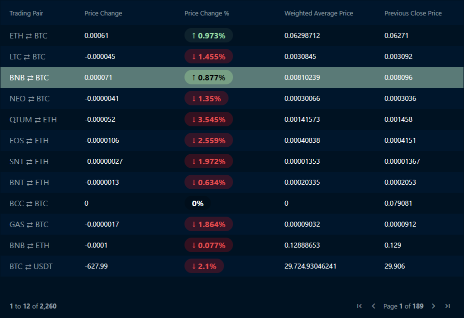

# Ag-Grid Ticker Table

This is an Ag-Grid table displaying trading pair data from the Binance exchange.

## Demo

You can check out the live version of this application at the following link:

[Live Demo](https://42ticker-table.netlify.app/)

## Description

This application fetches data from the Binance API and displays it in a tabular format using Ag-Grid. The table provides information about various trading pairs, including price changes, percentage change, weighted average price, and trading volumes coming from the Binance API endpoint `/api/v1/exchangeInfo`.

### Parsing of Symbols

The trading pair symbols are parsed to provide a more user-friendly and descriptive representation in the table. The `formatSymbolCell` function is used to map the raw symbols from the API to human-readable trading pair names. For example, the symbol `BTCUSDT` is displayed as `BTC ⇄ USDT`, where `BTC` is the base asset and `USDT` is the quote asset. To obtain symbols' base and quote assets, the Binance API endpoint `/api/v1/exchangeInfo` is used. In case of an error while fetching or if the symbol couldn't be found in this endpoint, the raw symbol from `/api/v3/ticker/24hr` will be used.

## Installation

To run the application locally, follow these steps:

1. Clone the repository: `git clone https://github.com/marijanasevo/ticker-table`
2. Navigate to the project directory: `cd ticker-table`
3. Install dependencies: `npm install`
4. Start the development server: `npm run dev`
5. Open your browser and go to: `http://localhost:5173`

## Technologies Used

- React.js v17
- Ag-Grid v27
- Axios
- CSS

## Credits

- [Ag-Grid](https://www.ag-grid.com/) - The grid library used in the project.
- Binance API:
  - [/api/v3/ticker/24hr](https://binance.com/api/v3/ticker/24hr)
  - [/api/v1/exchangeInfo](https://binance.com/api/v1/exchangeInfo)
